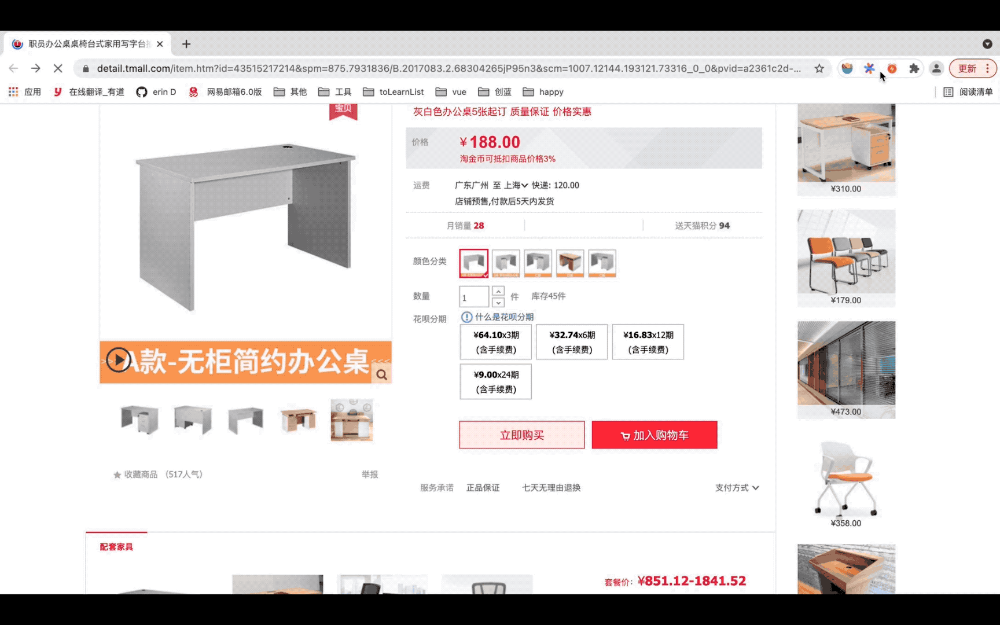

# 天猫秒杀 Chrome 插件开发指南

## 背景

之前某段时间，天猫、京东上兴起了一股限时秒杀茅台的热潮，我周边很多人都参与了。众所周知，现在很多网站只要出售啥供不应求的东西，大家都是使用脚本去自动刷购买任务的，人工等活动开始再抢购根本抢不到。于是我就去调研了这些脚本的实现技术、方式等。

- 技术：直接使用 js 就可以实现，对前端人员十分友好
- 方式：一是开发 Chrome 插件实现；二也可以在 Chrome 插件“油猴脚本”中引入运行自主开发的 js 实现。

鉴于 Chrome 插件可以实现的功能丰富多彩，如定制爬虫、屏蔽网页广告、网页实时查词等，我就采用了开发Chrome 插件的方式去实现简单的天猫秒杀，也希望通过这个例子大家能大致了解开发 Chrome 插件的相关知识。

## 开发 Chrome 插件必备知识

### manifest.json

这是一个 Chrome 插件最重要也是必不可少的文件，用来配置所有和插件相关的配置，必须放在根目录。其中，manifest_version、name、version 3个是必不可少的。

#### 常见的配置项

```json
{
  // 清单文件的版本，这个必须写，而且必须是2
  "manifest_version": 2,
  "name": "秒杀助手",
  "version": "1.0.0",
  "description": "秒杀助手插件",
  // 扩展程序中显示的图标
  "icons":
  {
    "16": "images/alarm.png",
    "48": "images/alarm.png",
    "128": "images/alarm.png"
  },

  // 浏览器右上角图标以及显示页面设置
  "browser_action": 
  {
    "default_icon": "images/alarm.png",
    // 图标悬停时的标题，可选
    "default_title": "秒杀助手",
    "default_popup": "index.html"
  },

  // 一直常驻的后台 JS 或后台页面
  "background":
  {
    // 2种指定方式，如果指定JS，那么会自动生成一个背景页
    // "page": "background.html"
    "scripts": ["lib/jquery-3.2.1.min.js","js/background.js"]
  },

  // 需要直接注入页面的 JS 或 CSS
  "content_scripts": 
  [
    {
      // 匹配的网址
      "matches": ["http://*/*", "https://*/*"],
      // "<all_urls>" 表示匹配所有地址
      // "matches": ["<all_urls>"],
      // 多个 JS 按顺序注入
      "js": ["lib/jquery-3.2.1.min.js", "js/secondKill.js", "js/submitBtnClick.js"],
      // 注入 css，注入时需要特别考虑是否会影响全局样式
      "css": ["css/addTask.css"],
      // 代码注入的时间，可选值： "document_start", "document_end", or "document_idle"，默认document_idle（页面空闲时）
      "run_at": "document_start"
    }
  ],
  // 权限申请
  "permissions":
  [
    "tabs", // 标签
    "activeTab", // 当前标签
    "storage", // 插件本地存储
    "notifications", // 通知
    "contextMenus", // 右键菜单
    "cookies",
    "webRequest", // web请求
    "http://*/*", // 可以通过 executeScript 或者 insertCSS 访问的网站
    "https://*/*" // 可以通过 executeScript 或者 insertCSS 访问的网站
  ],
  // 普通页面能够直接访问的插件资源列表，如果不设置是无法直接访问的
  "web_accessible_resources": ["js/addTask.js"],
  // 插件主页，浏览器右上角右键点击下拉菜单第一个选项可查看
  "homepage_url": "https://www.xxxx.com",
}
```

以上给出的是一些常见的配置项，完整的配置文档参考 [manifest 配置说明](https://developer.chrome.com/extensions/manifest)

#### popup

popup 是浏览器右上角插件图标时打开的一个小窗口网页，焦点离开网页就立即关闭，一般用来做一些临时性的交互。在此窗口页面中，点击右键检查可以审查和调试该页面。


由于单击图标打开面，焦点离开又立即关闭，所以 popup 页面的生命周期一般很短，需要长时间运行的代码不要写在 popup 页面中。

在权限上，几乎可以调用所有的 Chrome 扩展 API（除了devtools），而且它可以无限制跨域。它和 background 非常类似，之间最大的不同在于生命周期的不同。

#### background

background 是一个常驻的页面。进入 chrome://extensions/，点击对应插件模块的“背景页”按钮就可以直接打开 background 页，以及审查和调试该页面。但是打开的 background 页和真正一直在后台运行的那个页面不是同一个。换句话说，就是只能调试 background 页的代码，但看不到它的页面。


background 的生命周期是插件中所有类型页面中最长的，它随着浏览器的打开而打开，随着浏览器的关闭而关闭，所以通常把需要一直运行的、启动就运行的、全局的代码放在 background 里面。background 的权限也非常高，跟 popup 类似。

#### content-scripts

配置 content-scripts，Chrome 插件可以向浏览器页面中注入 JS 或 CSS。打开控制台，进行如下切换就可以调试注入的 JS 了。


content-scripts 和原始页面共享 DOM，但是不共享 JS。所以，注入的 JS 可以获取浏览器原始页面的 DOM 进行相关操作；注入 CSS 的时候，则要注意是否会影响页面其他样式。

此外，content-scripts 只能访问以下 4 种 `chrome.xxx.api`, 其他的都不可以。不过，这些 API 绝大部分时候都够用了。

- chrome.extension.[getURL | inIncognitoContext | lastError | onRequest | sendRequest]
- chrome.i18n
- chrome.runtime.[connect | getManifest | getURL | id | onConnect | onMessage | sendMessage]
- chrome.storage

#### 消息通信

popup 、background 以及 content-scripts 之间可以相互通信。特别的，由于 popup 和 background 访问的 API 都是一样的，对外的通信机制也都是一样的，所以对外可以将 popup 和 background 视为一种东西。

1. popup 和 background

popup 可以使用 `chrome.extension.getBackgroundPage` 方法获取 background 的 window 对象，从而调用 background 的 JS 方法和访问 background 的 DOM 对象。

```javascript
// background.js
function test() {
  console.log('我是background！');
}

// popup.js
let bg = chrome.extension.getBackgroundPage();
bg.test(); // 访问 background 的函数
console.log(bg.document.body.innerHTML); // 访问 background 的 DOM
```

background 访问 popup 可以使用 `chrome.extension.getViews` 方法（前提是 popup 已经打开）。

```javascript
let views = chrome.extension.getViews({ type: 'popup' });
if (views.length > 0) {
  console.log(views[0].document.body);
}
```

2. popup ( background ) 和 content-scripts

popup 或者 background 向 content-scripts 主动发送消息需要使用 `chrome.tabs.sendMessage` 方法，同时 content-script 中需要使用 `chrome.runtime.onMessage.addListener` 方法进行接收。

```javascript
// background.js 或者 popup.js
chrome.tabs.query({active: true, currentWindow: true}, function (tabs) {
  chrome.tabs.sendMessage(tabs[0].id, { value:'你好，我是 popup（background）！' }, function (response) {
    console.log('收到回复：' + response);
  });
});

// content-script.js
chrome.runtime.onMessage.addListener(function (request, sender, sendResponse) {
  console.log(request.value);
  sendResponse('我是 content-script，我收到了你的消息！');
});
```

此外，content-script 也可以使用 `chrome.runtime.sendMessage` 方法主动发消息给 popup 或者 background。同时，popup 或者 background则需要使用 `chrome.runtime.onMessage.addListener` 方法监听来自 content-script 的消息。

```javascript
// content-script.js
chrome.runtime.sendMessage({ greeting: '你好，我是content-script！' }, function (response) {
  console.log('收到回复：' + response);
});

// background.js 或者 popup.js
chrome.runtime.onMessage.addListener(function (request, sender, sendResponse)
{
  console.log(request.greeting);
  sendResponse('我是 background，我收到了你的消息！');
});
```

### 其他 chrome 常见 api 详解

1. 动态注入或执行 JS

通过 `chrome.tabs.executeScript` 来执行脚本，从而实现访问 web 页面的 DOM。

```javascript
// 动态执行JS代码
chrome.tabs.executeScript(tabId, { code: 'console.log("test");' });
// 动态执行JS文件
chrome.tabs.executeScript(tabId, { file: 'demo.js' });
```

2. 标签页查询

通过 `chrome.tabs.query` 可以根据条件查询标签页，并获取标签页的相关信息。

```javascript
// 获取当前标签页 ID
chrome.tabs.query({active: true, currentWindow: true}, function (tabs) {
  console.log('当前 tab id：', tabs.length ? tabs[0].id: null)
});
// 获取指定 URL 的标签页信息
chrome.tabs.query({ url:  'http://xxxx' }, function (results) {
  console.log('查询到的 tab：', results);
});
```

3. 本地存储

本地存储使用 `chrome.storage`，针对插件全局的，即使你在background中保存的数据，在content-script也能获取到。有 `chrome.storage.sync`（跟随当前登录用户自动同步） 和 `chrome.storage.local` 2种方式可供选择。

```javascript
// 读取数据，第一个参数是指定要读取的key以及设置默认值
chrome.storage.local.get({ color: 'red', age: 18 }, function(items) {
  console.log(items.color, items.age);
});
// 保存数据
chrome.storage.local.set({color: 'blue'}, function() {
  console.log('保存成功！');
});
```

更多 chrome api 见 [chrome api 文档](https://developer.chrome.com/extensions/api_index)

## 秒杀插件开发

> 前提：秒杀前需确保用户已登陆以及选择了购买商品的类型规格等

一般天猫秒杀步骤

- 在商品详情页中，秒杀时间一到立马点击购买按钮
- 紧接着，在订单详情页中，点击提交订单(此时已锁定商品，可稍后付款)

插件的 TO DO LIST

- 获取用户设置的秒杀时间以及需点击的秒杀按钮
- 后台设置定时器检查是否到达指定秒杀时间
- 秒杀时间到，模拟点击秒杀按钮，随后点击提交按钮
- 可视化任务列表，便于查看已添加任务

根据插件各组成成分及其特点，梳理需求点：

1. popup：已添加任务列表、新增任务按钮、当前时间
2. 动态注入 JS：添加新增任务表单（可供用户设定秒杀时间以及秒杀节点等属性）
3. background：定时检查任务是否到达秒杀时间并异步处理任务
4. 动态注入 JS：秒杀按钮点击，提交按钮点击

实现预览效果：



### 目录结构

```txt
根目录
├── manifest.json   // 插件配置
├── index.html      // popup page
├── css             // 存放 popup page 样式以及其他样式
├── images          // 存放图片资源，包括插件图标等
├── js              // 存放 JS 文件，包含 popup、background 以及 content-scripts 使用到的 JS
└── lib             // 资源库，存放 jQuery 等框架
```

### 分步骤开发

（1）添加 manifest.json 基础配置
（2）开发 popup page（index.html)，展示已添加任务列表、新增任务按钮、当前时间


（3）开发 addTask.js，添加新增任务表单


（4）开发 background.js，定时检查任务并异步处理任务
（5）开发 secondKill.js（秒杀按钮点击） 和 submitBtnClick.js（提交按钮点击）

## 附录

#### 好用 Chrome 插件推荐

- 沙拉查词：划词翻译
- Tampermonkey：脚本管理器
- Sourcegraph：Github 代码在线查看工具
- GitZip for github：可单独下载 Github 上某个文件

插件下载网址： [极简插件（不用墙](https://chrome.zzzmh.cn/index)

#### 参考文章

[【干货】Chrome插件(扩展)开发全攻略](https://www.cnblogs.com/liuxianan/p/chrome-plugin-develop.html#blog-comments-placeholder)

[谷歌(Chrome)浏览器插件开发教程](https://www.jianshu.com/p/51c650f98d9c)
